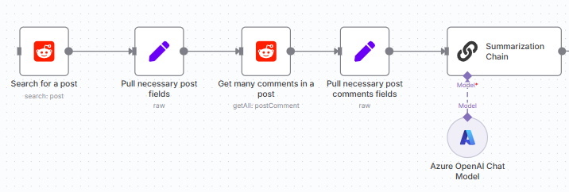

# dkorchun-n8n-projects

**Denis Korchun’s n8n Automations** – Real-world workflows designed and implemented by Denis.  

## Lab 1: Reddit Scraper Integration  

**Automate subreddit monitoring and data extraction with n8n.**  

### 🔍 Project Overview  
This workflow connects n8n to Reddit’s API to:  
- Monitor specified subreddits for new posts  
- Extract post metadata (title, author, timestamp, content)  
- Save results to Google Sheets or a database of your choice  

### ✨ Key Features  
- OAuth2 authentication with Reddit  
- Configurable subreddit list via environment variables  
- Built-in rate-limit handling and retry logic  
- Modular design for easy extension (e.g., alerting, AI analysis)

- 


### 🚀 Setup & Installation  
1. **Clone the repo**  
   ```bash
   git clone https://github.com/Gotlight/dkorchun-n8n-projects.git
   cd dkorchun-n8n-projects/lab-reddit-scraper
   ```
2. **Configure n8n Credentials**  
   - In n8n, add a **Reddit OAuth2** credential:  
     - Client ID/Secret from your Reddit “script” app  
     - Redirect URI: `https://denisk123.app.n8n.cloud/rest/oauth2-credential/callback`  
3. **Import the Workflow**  
   - In n8n, click **Import**, select `reddit-scraper.json`  
4. **Set Environment Variables**  
   ```text
   SUBREDDITS=programming,technology  
   FETCH_INTERVAL=5m  
   ```
5. **Activate the Workflow**  
   - Enable and verify the first execution  

### 📖 Usage  
- Scraped posts appear in the configured Google Sheet  
- Customize further nodes for notifications, downstream processing, or AI-based analysis  

### 📄 License  
MIT License  

***

*Built and maintained by Denis Korchun for practical, production-ready n8n automations.*
